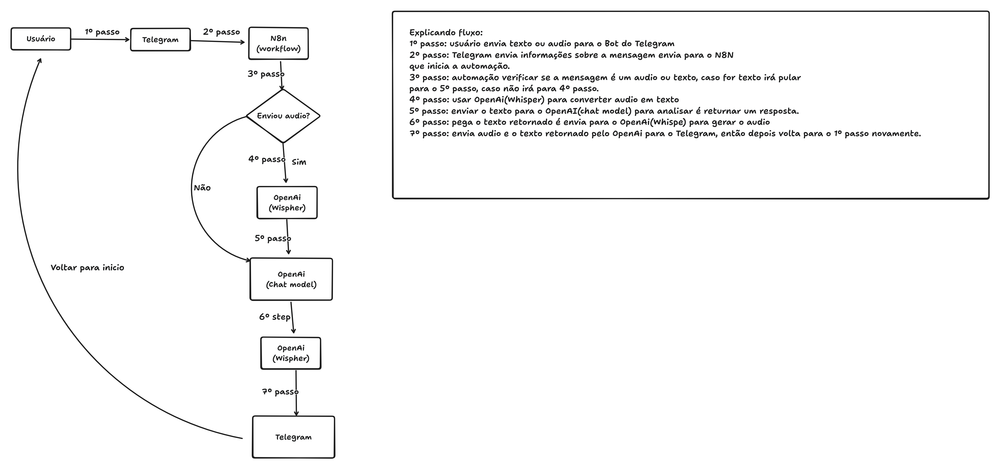

[PT]

## SOBRE

O projeto tem como foco criar um tutor de inglês para ajudar a melhorar a fala.

## COMO USAR

- Crie uma conta no n8n ou configure o n8n na sua máquina
- Acesse o aplicativo do n8n
- Crie um novo Workflow
- Após carregar o editor de Workflow, selecione a opção para importar um arquivo e escolha o arquivo **Language_tutor_AI.json**. PS: as informações para configurar o Telegram ou OpenAI estão dentro do Workflow importado.
- Ative o Workflow.
- Envie uma mensagem de texto ou áudio para o bot do Telegram que você criou

## TECNOLOGIAS

- Telegram (interface para se comunicar com o tutor de idiomas)
- OpenAI (Whisper) para extrair texto de áudios e gerar áudio a partir de texto
- OpenAI (modelo de chat) para retornar respostas com base no texto ou áudio enviado via Telegram
- N8N (ferramenta de automação)

## ARQUITETURA

[EN]

## ABOUT

The project has focus to create a english language tutor to help to improve the speak.

## HOW TO USE

- Create n8n account or setup the n8n on your machine
- Access the n8n app
- Create a new Workflow
- After load the Workflow editor select the option to import the file, so select the file **Language_tutor_AI.json**. PS: info to setup Telegram or OpenAi are inside the Workflow imported.
- Active the workflow.
- Send text or audio message on Telegram bot you created

## TECHNOLOGIES

- Telegram(interface to communicate with language tutor)
- OpenAI(Whisper) to extract text from audio and generate audio from text
- OpenAI(Chat model) to return results based the text or audio sent via Telegram
- N8N(automation tool)

## ARCHITECTURE

